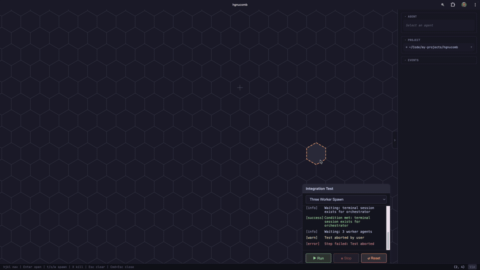

# hgnucomb

A spatial terminal multiplexer. Your terminals live on a hex grid -- navigate between them like an RTS, build spatial memory of your workspace, and optionally let AI agents coordinate across it.

<!-- TODO: replace with demo GIF/WebM -->
<!--  -->

## Why

Terminal multiplexers give you tabs and panes. That's a 1D mental model for an inherently multi-dimensional workflow. You have a dev server *over there*, tests *next to it*, a database shell *nearby*, and your editor *in the center*. You know where things are spatially -- your tools just don't.

hgnucomb puts your terminals on a 2D hex grid. Navigate with vim keys. Build a layout that mirrors how you think about your project. "The API server is up and to the left, the tests are to the right." That spatial memory persists across context switches in a way that "tab 4" never will.

And when you're ready for AI agents, they live on the same grid -- spawn them, watch them work, merge their code safely through a staging workflow with human approval.

## Quick Start

```bash
git clone git@github.com:kylesnowschwartz/hgnucomb.git
cd hgnucomb
just install    # pnpm install
just dev        # frontend :5173 + server :3001
```

Open http://localhost:5173.

### Install from source

```bash
git clone git@github.com:kylesnowschwartz/hgnucomb.git
cd hgnucomb
pnpm install && cd server && pnpm install && cd ..
pnpm build
node bin/hgnucomb.js
```

This builds the frontend, starts the server, and opens the browser.

### Prerequisites

- Node.js 20+
- pnpm
- [just](https://github.com/casey/just) command runner
- [Claude Code CLI](https://docs.anthropic.com/en/docs/claude-code) (`claude`) -- only needed for AI agents

## The Grid

Navigate with `hjkl` or arrow keys. Press `t` on any empty cell to spawn a terminal. Press `Enter` to open it. Press `Cmd+Escape` to close the panel and return to the grid. Your terminal keeps running in the background -- reopen it anytime.

That's it. Spatial terminals.

```
        ___
   ___/     \___
  /     dev     \___
  \   server   /     \___
   \___/     \/  tests   \
  /     \___/ \  runner  /
  /   db  \    \___/     \
  \  shell /   /     \___/
   \___/     \/  logs    \
        \___/ \  tail   /
               \___/
```

You build a layout once. You remember where things are. Navigating between "the server" and "the tests" becomes muscle memory, not tab-hunting.

## AI Agents (Optional)

With Claude Code installed, the grid becomes a process supervisor for AI agents.

Press `o` to spawn an **orchestrator** -- a Claude agent with MCP tools and its own git worktree. Give it a task:

> "Add a /health endpoint. Spawn one worker to implement it and another to write the test."

Workers appear on the grid as new hex cells, connected to the orchestrator by edges. Status badges cycle in real time: spawning -> working -> done.

### The Merge Safety Net

```
worker A ──commit──> worktree A ─┐
                                 ├── merge ──> orchestrator staging ──> you review ──> main
worker B ──commit──> worktree B ─┘
```

Every agent gets its own git worktree. Workers never touch main. The orchestrator merges into a staging branch. You review the diff. You approve. Then it lands.

**What this gives you over Claude Code's built-in team mode:**

- **Git worktree isolation** -- three agents editing the same file? No conflicts until you merge.
- **Staged merge workflow** -- human in the loop before main. Always.
- **Visual process control** -- see every agent with live status badges. Spawn, monitor, kill.
- **Scoped capabilities** -- orchestrators get spawn/merge tools, workers get report-only tools. Enforced at the MCP level.

## Key Concepts

| Concept | What it is |
|---------|-----------|
| **Terminal** | Plain shell session on the grid. No agent, just a PTY. The foundation. |
| **Orchestrator** | Claude agent with MCP tools (spawn, merge, broadcast). Gets its own git worktree. |
| **Worker** | Task-focused agent spawned by an orchestrator. Reports results back. |
| **Worktree isolation** | Every agent gets `git worktree add`. Parallel edits are safe. |
| **Staging merge** | Worker -> orchestrator staging -> human approval -> main. |

## Keyboard Shortcuts

Vim-style by default. Arrow keys also work.

### Grid

| Key | Action |
|-----|--------|
| `hjkl` / arrows | Move selection |
| `Shift+H/J/K/L` | Diagonal movement |
| `t` | Spawn terminal |
| `o` | Spawn orchestrator |
| `w` | Spawn worker |
| `Enter` | Open terminal panel |
| `Shift+X` | Kill (press twice) |
| `Escape` | Close panel / deselect |
| `g` | Jump to center |
| `?` | Help overlay |

### Terminal Panel

| Key | Action |
|-----|--------|
| `Cmd+Escape` | Close panel |
| `Cmd+hjkl` | Navigate grid with panel open |

## Architecture

React 19 + Vite frontend. Node.js + node-pty + WebSocket server. Konva.js renders the hex grid, xterm.js renders terminals, Zustand manages state, MCP SDK coordinates agents.

See [CLAUDE.md](CLAUDE.md) for the full architecture reference.

## Status

Working prototype.

**What's solid:**
- Hex grid with pan/zoom and keyboard navigation
- Terminal spawn/close/reopen lifecycle
- Orchestrator and worker lifecycle (spawn, monitor, kill)
- Git worktree isolation per agent
- MCP tools for agent coordination (15 tools)
- Staged merge workflow with conflict detection
- Live status badges with animations
- Claude Code plugin hooks (enforce `report_result` before worker exit)
- CLI entry point (`node bin/hgnucomb.js`)
- Prerequisite checks on startup (node, git, claude)

**What's next:**
- Session persistence across reloads
- Audio notifications on completion
